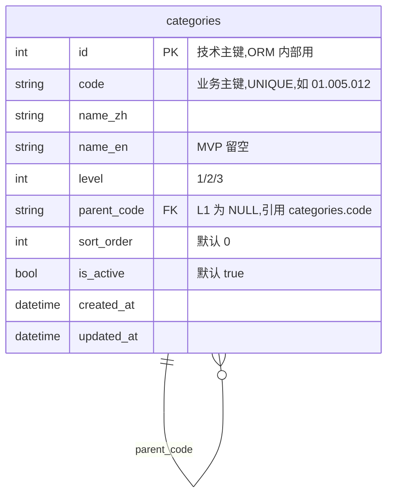
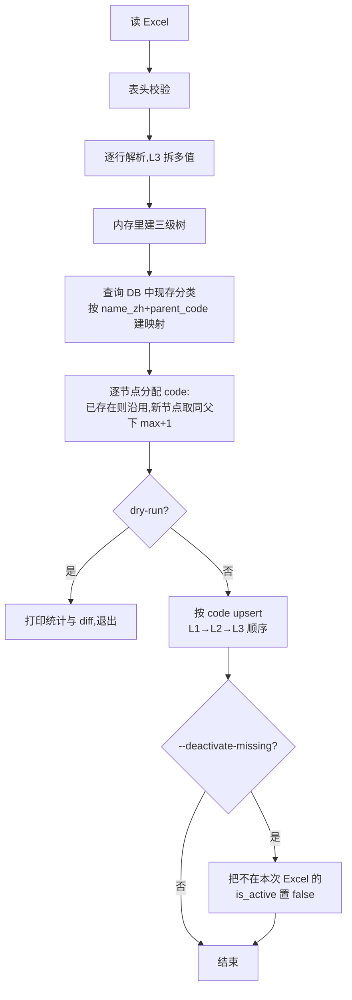

# 商品三级分类 PRD v1.0

> 状态:**已评审 / 可实施**(5 个决策点全部确认,见 §9)
> 作者:liujingjing
> 评审日期:2026-05-21
> 适用版本:MVP 第二轮(分类底座)
> 前置依赖:供应商注册 3 步向导(PR #15,已上线)

---

## 1. 背景与目标

### 1.1 背景

- MVP 业务流程共识(`docs/MVP业务流程共识_v1.4.md`)要求:供应商入驻 Step 2 选择"主营品类(三级分类)";商城需按品类导航;采购清单/询价按品类聚合。
- 当前项目**零分类代码**。Excel 源文件已就位:`data/三局产品三级分类(整合合同分类)20260516.xlsx`(中建三局口径,已整合合同分类)。
- 参考工程 `/Users/liujingjing/Documents/overseas-pro/overseas-supply-platform/`(TS + Prisma)已有完整实现,可作为设计参照,**但不能直接复用代码**(技术栈不同)。

### 1.2 目标(本轮 In-Scope)

| # | 目标 | 验收口径 |
|---|---|---|
| G1 | 建立 `categories` 单表自关联三级模型 | alembic upgrade 后表 / 索引齐全 |
| G2 | Excel → DB 一键导入脚本(可重跑) | 跑两次结果一致,记录数不变 |
| G3 | 灌入中建三局完整三级分类数据 | `SELECT count(*) FROM categories` ≥ Excel 行数 |
| G4 | 树形 / 扁平两个查询 API | `/api/v1/categories/tree` 返回三层嵌套 |
| G5 | 前端三级联动组件(Cascader/三 Select) | 选 L1 → L2 选项过滤;选 L2 → L3 选项过滤 |

### 1.3 非目标(本轮 Out-of-Scope,YAGNI)

- ❌ **不做**分类后台管理界面(增删改用 Excel 重灌)
- ❌ **不做**供应商主营品类绑定(单独一轮做,见 §9 后续工作)
- ❌ **不做**商品和分类绑定(等 Product 模型这一轮)
- ❌ **不做**分类版本/历史/审批
- ❌ **不做**英文名字段维护(Excel 没数据,name_en 留空)
- ❌ **不做**软删(置 `is_active=false` 替代)

---

## 2. 参考实现要点(借鉴,不照搬)

| 维度 | 参考做法 | 本项目决定 |
|---|---|---|
| 数据库 | 单表自关联 | ✅ 照搬 |
| 主键 | CUID 字符串 | ❌ 改 `Integer` 自增(符合 CLAUDE.md §6) |
| 编码 code | SHA1 哈希 | ❌ 改纯数字点分 `XX.XXX.XXX` 2-3-3 格式(对齐 UNSPSC/MRO 团标,见 §3.3 / D1) |
| Excel 解析 | 手写 XML | ❌ 改 `openpyxl`(标准库,够用) |
| 列名匹配 | 硬编码"一级分类"等 | ⚠️ 改"表头模糊匹配 + fail-fast 报错" |
| 三级单元格多值 | 用 `、,，;；\n\r` 拆分 | ✅ 照搬 |
| 幂等 | 文件 SHA256 + ImportLog | ⚠️ MVP 简化:按 `code` upsert,无 ImportLog 表 |
| API | tree + flat 双接口 | ✅ 照搬 |
| 前端联动 | 三原生 select + 一次性拉全树 | ✅ 照搬(数据量小) |

参考代码索引(仅供 review 时跳转):

- `prisma/schema.prisma:173-185`(模型)
- `scripts/import-categories-from-xlsx.ts`(导入脚本)
- `src/app/api/categories/tree/route.ts`(树 API)
- `src/app/supplier/products/new/page.tsx:23-89`(三级联动)

---

## 3. 数据模型

### 3.1 ER



### 3.2 字段约束

| 字段 | 类型 | 约束 | 说明 |
|---|---|---|---|
| `id` | Integer | PK,自增 | 技术主键,ORM 内部用,**不对外暴露作为关联键** |
| `code` | String(16) | UNIQUE,NOT NULL | **业务主键**,对外关联用,见 §3.3,**永久不变契约** |
| `name_zh` | String(128) | NOT NULL | 中文名,可变更 |
| `name_en` | String(128) | NULL | MVP 不维护 |
| `level` | Integer | NOT NULL,CHECK ∈ {1,2,3} | 层级 |
| `parent_code` | String(16) | FK→categories.code,NULL | level=1 时为 NULL;引用父节点的 code |
| `sort_order` | Integer | NOT NULL,默认 0 | 同级排序 |
| `is_active` | Boolean | NOT NULL,默认 true | 软停用 |
| `created_at` | DateTime | NOT NULL,UTC | 应用层赋值 |
| `updated_at` | DateTime | NOT NULL,UTC | 应用层更新 |

**索引**:

- `PRIMARY KEY (id)`
- `UNIQUE (code)`
- `INDEX (parent_code, level)`(查子级用)
- `INDEX (level, is_active, sort_order)`(查某层列表用)

**业务规则**:

- `level=1` ⇒ `parent_code IS NULL`
- `level∈{2,3}` ⇒ `parent_code` 必须指向 `level-1` 的记录(应用层校验,DB 用 FK 兜底)
- 删除走 `is_active=false`,**不物理删**
- **所有业务关联表(将来的 supplier_categories / product_categories 等)外键引用 `code`,不引用 `id`**

### 3.3 code 生成规则(D1 已确认:2-3-3 纯数字点分)

**格式**:`XX.XXX.XXX`,对齐 UNSPSC / 京东 MRO 团标的业界事实标准。

```
01                      # 第 1 个一级分类(2 位,容量 01-99)
01.005                  # 一级 01 下的第 5 个二级分类(2+3 位,容量每级 001-999)
01.005.012              # 二级 01.005 下的第 12 个三级分类(2+3+3 位)
```

**字段规则**:

- 一级:2 位数字,左补 0,容量 99
- 二级:`{L1}.{3 位}`,容量每个一级下 999
- 三级:`{L2}.{3 位}`,容量每个二级下 999
- 分隔符固定用半角点 `.`
- 序号按 Excel 出现顺序分配,**同名节点(同 parent 下)视为同一节点**
- 全表 `UNIQUE (code)`,可肉眼对照 Excel 调试

**示例**(套用中建三局口径):

```
01                      围护幕墙
  01.001                  玻璃幕墙
    01.001.001              明框玻璃幕墙
    01.001.002              隐框玻璃幕墙
  01.002                  金属幕墙
    01.002.001              铝板幕墙
02                      机电安装
  02.001                  给排水
    02.001.001              ...
```

### 3.4 code 永久不变契约(设计红线)

`code` 一旦分配,**永久不变**。这是本表对外提供"业务主键"的安全承诺,所有引用方据此假设设计。

**不会触发 code 变更的操作**(放心做):

- 修改 `name_zh` / `name_en` / `sort_order` / `is_active`
- Excel 中同级调换顺序
- Excel 中新增/删除其他节点(走 §4.5 "沿用已有 code"算法)

**唯一会让 code "看起来变"的场景**:

- 节点物理迁移到不同父级下(改 `parent_code`)
  → **不允许直接改**,处理方式是:**旧节点 `is_active=false` 保留 + 新位置分配新 code**
  → 关联表的数据通过运维脚本逐条迁移,不做隐式级联

**容量足够吗?**(99 / 999 / 999)

- 一级 99:建工 EPC 一级类目 10-30 个,**3 倍冗余**
- 二级 999:单个一级下二级一般 30-80 个,**10 倍冗余**
- 三级 999:单个二级下三级一般几十到一百多,**5 倍冗余**
- 极端撞墙概率:接近零

**真撞墙了怎么办?**

- 不扩位(扩位会破坏 code 不变契约,代价大)
- 业务上一定可以拆分:把过密的一级分裂成两个一级(如把"机电安装"拆成"机电"和"安装"),用新一级 code 收纳新增二级
- 这是业务决策,不是技术决策

---

## 4. Excel 导入设计

### 4.1 Excel 表结构(预期)

| 列序 | 表头(模糊匹配) | 说明 |
|---|---|---|
| A | 一级分类 / 一级 / Level1 | 必填 |
| B | 二级分类 / 二级 / Level2 | 必填 |
| C | 三级分类 / 三级 / Level3 | 可多值,用 `、,，;；\n\r` 拆分 |

> 表头匹配规则:取首行,strip + 转小写后做包含匹配。未匹配上 fail-fast 退出并打印实际表头,方便排查。

### 4.2 数据落位文件

- 路径:项目根 `data/` 目录
- 当前文件:`data/三局产品三级分类(整合合同分类)20260516.xlsx`

**约定**:

- Excel 入 Git(MVP 阶段,数据量小,方便所有人复现)
- **路径强制**:文件必须放在项目根 `data/` 目录下,**脚本拒绝读取 `data/` 外的路径**(防止误指向桌面/U 盘临时文件)
- **文件名不强制规范**:`data/` 内的 xlsx 文件名任意(中文、空格、括号都允许)
- 同一时间 `data/` 下可能有多份 xlsx(历史版本、不同版本),脚本默认取**修改时间最新**的一份;有歧义时打印列表并提示用 `--file` 指定
- 历史版本可以保留也可以清理,由人工决定,脚本不自动删
- `data/` 下**不放敏感数据**(价格、合同、客户名单等),仅放分类口径这类公开主数据

### 4.3 脚本接口

```bash
# 默认从项目根 data/ 下扫 *.xlsx,取 mtime 最新的一份;多份歧义时打印列表退出
python scripts/import_categories.py

# 显式指定文件(路径必须在 data/ 下,可写相对或绝对路径,脚本会校验)
python scripts/import_categories.py --file ../data/三局产品三级分类(整合合同分类)20260516.xlsx

# 只看结果不写库
python scripts/import_categories.py --dry-run

# 自动停用 Excel 中已删除的分类(谨慎用)
python scripts/import_categories.py --deactivate-missing
```

### 4.4 导入算法



### 4.5 "沿用已有 code"算法(保证 code 永久不变)

为兑现 §3.4 契约,导入脚本必须满足:

```python
# 伪代码
for node in excel_tree.walk():  # L1 → L2 → L3 顺序
    existing = db.query(
        Category,
        where=(name_zh=node.name_zh, parent_code=node.parent_code)
    )
    if existing:
        node.code = existing.code              # 已有 code,沿用
        upsert(name_zh, sort_order, is_active=True)
    else:
        # 新节点:取同父下当前 max 序号 + 1
        max_seq = db.query_max_seq(parent_code=node.parent_code, level=node.level)
        node.code = build_code(node.parent_code, max_seq + 1)
        insert(...)
```

**关键不变量**:

- 匹配以 `(name_zh, parent_code)` 为键,不是 Excel 行号
- Excel 中调换行顺序 → name_zh 仍能匹配上 → code 不变
- Excel 中新增节点 → 取空号,不抢占老 code
- Excel 中删除节点 → 数据库里保留(默认),除非 `--deactivate-missing`

### 4.6 幂等保证

- 同一 Excel 重复跑,记录数 / code / 字段值都不变
- upsert 按 `code` 唯一键:存在则更新 `name_zh / sort_order / is_active=true`,不存在则插入
- 不维护 ImportLog 表(MVP 简化,后续按需补)

---

## 5. 后端 API

### 5.1 路由

| Method | Path | 说明 | 权限 |
|---|---|---|---|
| GET | `/api/v1/categories` | 扁平列表 | 公开(注册时要用) |
| GET | `/api/v1/categories/tree` | 树形结构 | 公开 |

### 5.2 查询参数

`/api/v1/categories`:

| 参数 | 类型 | 默认 | 说明 |
|---|---|---|---|
| `level` | int | - | 可选,只返回某一层 |
| `parent_code` | string | - | 可选,只返回某父节点(按 code)的子级 |
| `is_active` | bool | true | 默认只返回启用的 |

`/api/v1/categories/tree`:

| 参数 | 类型 | 默认 | 说明 |
|---|---|---|---|
| `is_active` | bool | true | 默认只返回启用的 |

### 5.3 响应 Schema

**flat**:

```json
{
  "code": 0, "message": "ok",
  "data": [
    { "id": 1, "code": "01", "name_zh": "围护幕墙", "level": 1, "parent_code": null, "sort_order": 0 }
  ]
}
```

> 注:响应中 `id` 字段保留(便于前端 React key),但**外部系统集成时只用 `code`**。

**tree**:

```json
{
  "code": 0, "message": "ok",
  "data": [
    {
      "id": 1, "code": "01", "name_zh": "围护幕墙", "level": 1,
      "children": [
        {
          "id": 11, "code": "01.001", "name_zh": "玻璃幕墙", "level": 2,
          "children": [
            { "id": 111, "code": "01.001.001", "name_zh": "明框玻璃幕墙", "level": 3, "children": [] }
          ]
        }
      ]
    }
  ]
}
```

### 5.4 性能与缓存

- 全表预计 < 1000 条,**不加缓存**,每次查全表 + 内存建树
- 后续若变慢再加进程内 TTL 缓存,**禁止引入 Redis**(CLAUDE.md 红线)

---

## 6. 前端组件

### 6.1 组件位置

```
frontend/src/components/category/CategoryCascader.tsx        # 三级联动组件
frontend/src/lib/api/categories.ts                            # API 封装
frontend/src/hooks/useCategoryTree.ts                         # SWR 拉树
```

### 6.2 组件 API

```ts
type SelectedCategory = {
  level1Code: string | null;   // 如 "01"
  level2Code: string | null;   // 如 "01.005"
  level3Code: string | null;   // 如 "01.005.012"  ← 最终业务关联用这个
};

<CategoryCascader
  value={selected}
  onChange={(v: SelectedCategory) => setSelected(v)}
  required?: boolean;
  disabled?: boolean;
/>
```

> 注:组件对外传出的"被选中分类"是 **L3 的 code**,即叶子节点。上层业务表单提交时把 `level3Code` 作为 `category_code` 写入关联表。

### 6.3 行为规则

| 场景 | 行为 |
|---|---|
| 初次渲染 | SWR 拉 `/api/v1/categories/tree`,加载中 disable |
| L1 变更 | 清空 L2/L3,L2 下拉重算 |
| L2 变更 | 清空 L3,L3 下拉重算 |
| 上级未选 | 下级 disabled + 显示"请先选上级" |
| 数据为空 | 显示"暂无数据,请联系管理员" |

### 6.4 使用页面(本轮先建组件,后续轮接入)

- (后续)供应商入驻 Step 2:主营品类多选
- (后续)商品发布表单
- (后续)商城品类导航

---

## 7. 任务清单与工作量

```mermaid
gantt
    title 商品三级分类实施甘特
    dateFormat  X
    axisFormat %s
    section 后端
    DB Model + 迁移            :a1, 0, 3
    Excel 导入脚本             :a2, after a1, 5
    灌种子数据 + 验证          :a3, after a2, 1
    API + Schema + Service     :a4, after a3, 5
    后端测试                   :a5, after a4, 3
    section 前端
    API 封装 + Hook            :b1, after a4, 2
    CategoryCascader 组件      :b2, after b1, 3
    前端手工验证               :b3, after b2, 1
```



| # | 任务 | 路径 | 工作量 |
|---|---|---|---|
| T1 | `Category` model + alembic 迁移 | `backend/app/db/models/category.py`<br>`backend/alembic/versions/xxxx_add_categories.py` | 0.3d |
| T2 | Excel 导入脚本(openpyxl) | `backend/scripts/import_categories.py` | 0.5d |
| T3 | 首次灌数 + 数据核对 | 直接读 `data/三局产品三级分类(整合合同分类)20260516.xlsx` | 0.1d |
| T4 | Service(查树/查扁平) | `backend/app/services/category.py` | 0.2d |
| T5 | Schema(Pydantic) | `backend/app/schemas/category.py` | 0.1d |
| T6 | API 路由 | `backend/app/api/v1/categories.py` | 0.2d |
| T7 | 后端 pytest | `backend/tests/test_categories.py`<br>`backend/tests/test_import_categories.py` | 0.3d |
| T8 | 前端 API + Hook | `frontend/src/lib/api/categories.ts`<br>`frontend/src/hooks/useCategoryTree.ts` | 0.2d |
| T9 | CategoryCascader 组件 | `frontend/src/components/category/CategoryCascader.tsx` | 0.3d |
| T10 | 前端 demo 页 + 手工验证 | `frontend/src/app/test/category/page.tsx`(临时) | 0.2d |
| - | **合计** | | **~2.4 人日** |

---

## 8. 验收标准(完工口径)

后端:

- [ ] `alembic upgrade head` 成功创建 `categories` 表
- [ ] `python scripts/import_categories.py` 成功灌数,记录数与 Excel 一致
- [ ] 重跑一次,记录数不变(幂等)
- [ ] `pytest backend/tests/test_categories.py` 全绿
- [ ] `curl /api/v1/categories?level=1` 返回所有一级分类
- [ ] `curl /api/v1/categories/tree` 返回三层嵌套
- [ ] `bash scripts/verify.sh` 通过

前端:

- [ ] `frontend/src/app/test/category/page.tsx` 能渲染 Cascader
- [ ] 选 L1 → L2 选项联动正确
- [ ] 选 L2 → L3 选项联动正确
- [ ] L1 改变 → L2/L3 自动清空
- [ ] 手工跑通登录态外的访问(API 公开)

---

## 9. 决策记录(全部已确认 2026-05-21)

| 编号 | 决策 | 选项 | 推荐 | 状态 |
|---|---|---|---|---|
| D1 | code 生成规则 | A) SHA1 哈希<br>B) `L1_001 / L2_001_005` 字母前缀编号<br>**C) `XX.XXX.XXX` 2-3-3 纯数字点分**(对齐 UNSPSC/MRO 团标) | **C** | ✅ **已确认 2026-05-21**:采用 2-3-3,关联表外键用 `code` 而非 `id`,code 永久不变契约写入 §3.4 |
| D2 | 三级单元格多值拆分 | A) 不拆,一格一节点<br>B) 用 `、,，;；\n\r` 拆 | **B**(业务数据确实长这样) | ✅ **已确认 2026-05-21**:采用 B,分隔符常量定义在脚本里,后续若发现遗漏分隔符在常量表里追加 |
| D3 | Excel 文件入 Git? | A) 入 Git(`data/`)<br>B) 不入,放外部 | **A**(MVP,数据非敏感,方便复现) | ✅ **已确认 2026-05-21**:入 Git;**路径强制在 `data/` 下**(脚本拒绝读外部路径);文件名不强制规范;脚本默认取 mtime 最新的 xlsx,有歧义打印列表提示 `--file` 指定 |
| D4 | Excel 重灌时,Excel 中已删除的分类如何处理? | A) 默认保留,只 `--deactivate-missing` 显式停用<br>B) 默认停用,加 flag 保留<br>C) 物理删 | **A**(最安全) | ✅ **已确认 2026-05-21**:A 默认保留;`--deactivate-missing` 显式才停用;**永不物理删**;dry-run 必须打印 `新增/更新/保留不动/将停用` 差异统计 |
| D5 | 是否本轮做"供应商主营品类绑定"? | A) 本轮做<br>B) 单独一轮做 | **B**(避免和已上线 v1.4 打架) | ✅ **已确认 2026-05-21**:B 单独一轮做;本轮只交付"分类底座"(表/导入/API/组件/demo 页),供应商入驻接入、商城导航、商品绑定等留给后续轮次 |

---

## 10. 风险与已知坑

| 风险 | 概率 | 应对 |
|---|---|---|
| Excel 表头与预期不符 | 中 | 模糊匹配 + fail-fast 报错,打印实际表头 |
| 三级单元格多值分隔符不在内置集 | 低 | 报错后人工加分隔符到脚本常量 |
| 同名节点歧义(L2 下两个同名 L3) | 低 | 视为同一节点(去重),并在导入日志打 warn |
| 全树 API 性能 | 低 | 全表 < 1000 条,无需优化;超过再加缓存 |
| 后续要加英文名 | 低 | 字段已留 `name_en`,补一个翻译脚本即可 |
| 误用 `data/` 外的 Excel | 低 | 脚本对 `--file` 做路径校验,非 `data/` 下直接 fail-fast |
| 后续误改 code 破坏 §3.4 契约 | 中 | §11 红线第 7 条 + 后端 model 加注释 + 关联表 FK 强制引用 `code` |
| 二级分类未来撞 999 上限 | 极低 | 业务拆分(把过密的一级分裂),不扩位;详见 §3.4 |

---

## 11. 实施顺序约束(给 Claude Code 的红线)

1. **必须**按 T1 → T2 → T3 → T4 → T5 → T6 → T7 → T8 → T9 → T10 顺序,前序未完不动后序
2. **必须**在 T1 写完后让我 review 迁移文件,通过后再 `alembic upgrade`
3. **必须**在 T2 写完后用 `--dry-run` 跑一遍给我看结果,通过后再 T3
4. **禁止**在本 PRD 范围外擅自加字段/接口/页面(YAGNI)
5. **禁止**引入 Redis / 缓存中间件 / OCR / AI(MVP 红线)
6. **禁止**改 Q22-Q28 已闭环决策(见 CLAUDE.md)
7. **禁止**违反 §3.4 "code 永久不变"契约:不得在脚本中实现"改名时同步改 code"逻辑;不得为关联表使用 `category_id` 作为外键

---

## 12. 参考文档

- `docs/MVP业务流程共识_v1.4.md` —— 业务流程出处
- `docs/claude_code_full_dev_prompt.md` —— 早期开发指引,商城/分类章节
- `CLAUDE.md` —— 项目级强约束(技术栈、命名、红线)
- `/Users/liujingjing/Documents/overseas-pro/overseas-supply-platform/` —— 参考工程
- `data/三局产品三级分类(整合合同分类)20260516.xlsx` —— 数据源(本项目内)

---

*PRD 结束。5 个决策点已全部确认(2026-05-21),可进入实施(T1 → T10)。*
