# 商品三级分类 PRD v2.0 · 严选商城分类导航

> 状态:**已评审 / 可实施**(4 个决策点全部确认,见 §8)
> 作者:liujingjing
> 评审日期:2026-05-21
> 适用版本:MVP 第三轮(分类导航上墙)
> 前置依赖:
> - 商品三级分类 PRD v1.0(分类底座,已上线 `feat/category-base`)
> - 供应商注册 3 步向导 v1.5(已上线)

---

## 1. 背景与目标

### 1.1 背景

- v1.0 已交付**分类底座**:`categories` 表 + 导入脚本 + tree/flat API + Cascader 组件 + demo 页
- 当前 `/mall` 路由仍是占位,需要换成真实的"严选商城"页面
- **参考工程** `/Users/liujingjing/Documents/overseas-pro/overseas-supply-platform/` 已有完整的 mall 页面实现(556 行),视觉、交互、左侧分类侧边栏全部符合本次需求图,可**直接复用**

### 1.2 目标(本轮 In-Scope)

| # | 目标 | 验收口径 |
|---|---|---|
| G1 | `/mall` 路由变成真实"严选商城"页面 | 浏览器访问 `/mall` 看到完整 hero + sidebar + 占位主区 |
| G2 | 左侧"产品分类"侧边栏完整接入 1911 条分类 | 4 个一级 + hover 飞出二级 + 二级下三级列表 |
| G3 | URL 同步当前选中分类 | `?cat=01.001` 类查询参数,刷新保持状态 |
| G4 | Hero(标题/搜索框)、Filter bar、分页 UI 上墙 | 视觉对齐参考图 |

### 1.3 非目标(本轮 Out-of-Scope,YAGNI)

- ❌ **不做** Product 后端模型 / API / 数据
- ❌ **不做** `ProductCard` 组件 / shadcn `Badge` 组件
- ❌ **不做** 真实搜索逻辑(搜索框不接后端)
- ❌ **不做** Filter bar(出口国家 / T1-T3)实际筛选(chip UI 保留,点击无后端动作)
- ❌ **不做** 真实分页(分页 UI 保留但 disabled)
- ❌ **不做** 供应商主营品类绑定(留给 v3.0)
- ❌ **不做** 移动端深度优化(参考代码自带 mobile 版,搬过来 work 即可)

---

## 2. 参考实现复用策略

参考工程:`/Users/liujingjing/Documents/overseas-pro/overseas-supply-platform/src/app/(marketing)/mall/page.tsx`(556 行)

### 2.1 直接复用部分

| 区块 | 参考行号 | 复用方式 |
|---|---|---|
| Hero(标题 + 橙下划线 + 搜索框) | 187-213 | 整段拷贝 |
| 左侧 sidebar + 一级列表 | 219-277 | 整段拷贝(改字段) |
| Hover 飞出式二级面板 | 279-315 | 整段拷贝(改字段) |
| Mobile 折叠版 sidebar | 318-389 | 整段拷贝(改字段) |
| Filter bar UI(出口国家 + T1-T3 chip) | 396-446 | 整段拷贝,**不接逻辑** |
| 结果信息 + 选中 chip | 449-471 | 整段拷贝 |
| 分页 UI | 505-550 | 整段拷贝,**不接逻辑** |

### 2.2 改造点

| # | 参考工程 | 我们项目 | 改造动作 |
|---|---|---|---|
| C1 | 字段名 `nameZh / nameEn / sortOrder` (camelCase) | `name_zh / name_en / sort_order` (snake_case) | 全文替换字段名 |
| C2 | `category.id: string` (CUID) | `id: number` | TypeScript interface 改 |
| C3 | `fetch('/api/categories/tree')` 直接拿数组 | `categoriesApi.tree()` 返回剥过 `data` 的数组 | 替换调用 |
| C4 | `fetch('/api/products?...')` + products state + ProductCard 渲染 | 后端没有 products API | **整段干掉**,改成占位 |
| C5 | Filter bar 各 chip 触发 `setSelectedCountry/setSelectedTier` + 重拉商品 | 没有 products 数据 | UI 保留,setState 保留(用于可视反馈),不重拉 |
| C6 | 分页 `setPage` 触发重拉商品 | 同上 | UI 保留,**禁用按钮**(`disabled`) |

### 2.3 不复用部分

- ❌ `ProductCard` 组件
- ❌ shadcn `Badge` 组件依赖
- ❌ `/api/products` Next.js API route(我们后端是 FastAPI,products 模型还没建)

---

## 3. 数据模型

**无变化**,完全沿用 v1.0 §3 的 `categories` 表。本轮纯前端工作。

---

## 4. 后端 API

**无变化**,完全沿用 v1.0 §5 的两个公开接口:

- `GET /api/v1/categories?level=&parent_code=&is_active=`
- `GET /api/v1/categories/tree?is_active=`

---

## 5. 前端实施详细

### 5.1 文件清单

| 操作 | 文件 | 说明 |
|---|---|---|
| 重写 | `frontend/src/app/mall/page.tsx` | 从占位改成完整 mall 页面 |
| 复用 | `frontend/src/lib/api/categories.ts` | v1.0 已有,不动 |
| 复用 | `frontend/src/hooks/useCategoryTree.ts` | v1.0 已有,不动 |
| Verify | `frontend/src/components/layout/Header.tsx` | 检查"严选商城" tab,缺则加 |

### 5.2 mall 页面状态机

```
URL ?cat=XXX  ──→  selectedCategory(string)
                       │
                       ├─ "" → "全部分类"高亮,主区"商品功能开发中"
                       ├─ "01" → 一级"土建工程"高亮 + 左竖条
                       ├─ "01.001" → 一级高亮 + 二级"钢筋类"高亮
                       └─ "01.001.001" → 三级"螺纹钢"完整路径高亮

hoveredLevel1(string)  ──→  控制飞出式二级面板显隐(纯交互态,不入 URL)
expandedLevel1(string) ──→  控制 mobile accordion 展开(同上,不入 URL)
```

### 5.3 主区占位规范(Q1 已确认:A)

```tsx
{selectedCategory ? (
  <div className="bg-white rounded-2xl py-24 text-center border border-gray-100 shadow-sm">
    <p className="text-base font-medium text-gray-600">
      商品功能开发中,当前选中分类:
      <span className="ml-2 font-bold text-[#003366]">{selectedCategoryName}</span>
    </p>
    <p className="text-sm text-gray-400 mt-1">code = <code>{selectedCategory}</code></p>
  </div>
) : (
  <div className="...">
    <p>商品功能开发中,左侧选择分类查看品类结构</p>
  </div>
)}
```

### 5.4 URL 同步(Q3 已确认:A)

- 用 `useSearchParams` + `router.replace` 维护 `?cat=` 单个查询参数
- 初次加载:从 URL 读 → 初始化 `selectedCategory`
- 用户点击:`setSelectedCategory(code)` 同时 `router.replace(?cat=code)`(不入栈,避免后退键噪音)
- "全部分类":URL 移除 `cat` 参数

### 5.5 视觉色板(沿用 brand)

| 用途 | 色值 | 我们 tailwind config 有? |
|---|---|---|
| 主色深蓝 | `#003366` | ✅ `brand.DEFAULT` |
| 选中高亮蓝 | `#1D6FF2` | ❌ 缺,本轮 inline 使用 |
| 强调橙 | `#FF6B35` | ✅ `brand.accent` |
| 页面背景灰 | `#F5F7FA` | ❌ 缺,本轮 inline 使用 |

> 简化原则:不为 2 个新色加 token,直接 inline `bg-[#1D6FF2]` / `bg-[#F5F7FA]` 跟参考工程一致。

---

## 6. 任务清单与工作量

```mermaid
gantt
    title v2.0 实施甘特
    dateFormat  X
    axisFormat %s
    section 前端
    拷代码 + 字段改造     :a1, 0, 3
    products 段干掉+占位  :a2, after a1, 2
    URL 同步             :a3, after a2, 2
    Header tab verify    :a4, after a3, 1
    手动验证 + 截图       :a5, after a4, 2
```



| # | 任务 | 文件/路径 | 工作量 |
|---|---|---|---|
| T1 | 拷参考工程 mall/page.tsx → 我们项目 | `frontend/src/app/mall/page.tsx` | 0.1d |
| T2 | 字段名 camelCase → snake_case | 同上 | 0.1d |
| T3 | 替换 `fetch('/api/categories/tree')` → `categoriesApi.tree()` | 同上 | 0.1d |
| T4 | 干掉 products 相关(fetch / state / ProductCard 渲染) | 同上 | 0.2d |
| T5 | 主区占位卡片(Q1 方案 A) | 同上 | 0.1d |
| T6 | URL 同步 `?cat=` | 同上 | 0.2d |
| T7 | Filter bar UI 保留,visual-only 切换(Q2 方案 A) | 同上 | 0.1d |
| T8 | 分页按钮 disabled | 同上 | 0.05d |
| T9 | Header tab "严选商城" verify/补 | `frontend/src/components/layout/Header.tsx` | 0.1d |
| T10 | tsc / lint / build 通过 + 手动验证 + 截图 | - | 0.2d |
| - | **合计** | | **~1.2 人日** |

---

## 7. 验收标准

### 7.1 视觉(对照需求图)

- [ ] 顶部导航高亮"严选商城"tab
- [ ] Hero:标题"严选商城"(深蓝 #003366)+ 橙色短下划线 + 副标题 + 大搜索框 + 深蓝"搜索"按钮
- [ ] 左侧 sidebar 标题"产品分类"+ slider 图标
- [ ] "全部分类"项默认高亮(蓝底 + 左侧竖条)
- [ ] 4 个一级分类卡片:粗体一级名 + 副标题(前 2 个二级名 ` / ` 拼接)+ 右 chevron
- [ ] Hover 一级 → 右侧飞出二级面板,内含 L2 标题 + 横排 L3 链接
- [ ] Filter bar:出口国家 9 个 chip + 供应商级别 4 个 chip(纯视觉)
- [ ] 右侧主区占位卡片显示"商品功能开发中"

### 7.2 交互

- [ ] 鼠标移到一级 → 飞出二级面板;鼠标移开整个 sidebar → 关闭面板
- [ ] 点击一级/二级/三级任意一项 → `selectedCategory` 变更,URL `?cat=` 同步
- [ ] 选中态左竖条 + 蓝底高亮在三级中**完整路径**都生效(L3 选中时 L1/L2 也高亮)
- [ ] 点击"全部分类" → 清空 `selectedCategory`,URL 移除 `?cat=`
- [ ] 浏览器后退键 → 状态恢复(因为 URL 同步)
- [ ] 直接访问 `?cat=01.001.001` → 页面打开就高亮该路径

### 7.3 工程

- [ ] `pnpm tsc --noEmit` 通过
- [ ] `pnpm lint` 无 warning
- [ ] `pnpm build` 通过,`/mall` 路由可静态/动态渲染
- [ ] 不动后端任何代码
- [ ] 不引入新 npm 依赖

---

## 8. 决策记录(全部已确认 2026-05-21)

| 编号 | 决策 | 选项 | 推荐 | 状态 |
|---|---|---|---|---|
| Q1 | 主区占位形态 | A) 占位卡片显示选中分类名+code<br>B) 永远 loading 骨架屏<br>C) 完全空白 | **A** | ✅ **已确认 2026-05-21**:A 方案;无选中时展示"左侧选择分类查看品类结构",有选中时展示分类名 + code |
| Q2 | Filter bar(国家/T1-T3) 行为 | A) UI 保留,chip 可视觉切换 active 态,无后端动作<br>B) 不显示 | **A** | ✅ **已确认 2026-05-21**:A 方案;`setSelectedCountry / setSelectedTier` state 保留(便于可视反馈),但**不**触发任何 fetch |
| Q3 | URL 同步选中分类 | A) `?cat=01.001` query 同步 + `replace` 不入栈<br>B) 不同步,刷新重置 | **A** | ✅ **已确认 2026-05-21**:A 方案;用 `router.replace`(不入栈),后退键不会反复出现 mall 状态 |
| Q4 | 顶部"严选商城"tab 处理 | A) 已有 → 仅 verify 高亮<br>B) 没有 → 新增到 Header 导航 | 看 verify 结果 | ✅ **已确认 2026-05-21**:实施时先 verify Header,缺则按参考工程 Header.tsx L12 样式补;tab `label: "严选商城" / en: "Mall" / href: "/mall"` |

---

## 9. 风险与已知坑

| 风险 | 概率 | 应对 |
|---|---|---|
| 字段改造遗漏(camelCase 残留) | 中 | tsc 严格模式 + 全文 grep 双保险 |
| Hover 飞出面板在小屏溢出 | 低 | 参考代码已有 `max-w-[calc(100vw-22rem)]` 保护 |
| URL `?cat=` 与未来 `?country=&tier=` 共存 | 低 | 用 `URLSearchParams` 而非字符串拼接 |
| `useSearchParams` 在 Next.js 14 需 Suspense | 中 | 必要时包 `<Suspense>` 包裹 |
| 参考工程依赖 shadcn Badge | 中 | 本轮不用 ProductCard,不引入 Badge |
| `/api/v1/categories/tree` 响应格式与组件不一致 | 低 | 已在 §2.2 C3 列入改造点 |

---

## 10. 实施顺序约束(给 Claude Code 的红线)

1. **必须**按 T1 → T10 顺序,前序未完不动后序
2. **必须**在 T1 拷贝后立刻跑一次 `tsc --noEmit`,看完整错误清单(预期一堆,因为字段名 + import 都没改),据此驱动 T2-T4
3. **禁止**为本轮新增任何后端代码(model / API / migration)
4. **禁止**新增 npm 依赖(lucide-react / swr 已有就够了)
5. **禁止**修改 v1.0 已交付的:`categoriesApi` / `useCategoryTree` / `CategoryCascader` / `categories` 后端 API
6. **禁止**修改 `app/main.py` / `app/seed.py` / Docker / deploy / .github
7. **禁止**违反 PRD v1.0 §3.4 "code 永久不变"契约
8. **commit 粒度**:每个 T 一个 commit(可以合并语义相近的相邻 T),最终不超过 5 个 commit
9. **PR**:基于 main 切新分支 `feat/mall-category-nav`,**不**复用 v1.0 的 `feat/category-base` 分支

---

## 11. 参考文档

- `docs/商品三级分类-PRD-v1.0.md` — 分类底座 PRD,本轮所有数据/API 契约的源
- `docs/MVP业务流程共识_v1.4.md` — 业务流程(严选商城 = 流程 2 的入口)
- `CLAUDE.md` — 项目级约束
- `/Users/liujingjing/Documents/overseas-pro/overseas-supply-platform/src/app/(marketing)/mall/page.tsx` — **核心复用源**
- `/Users/liujingjing/Documents/overseas-pro/overseas-supply-platform/src/components/layout/Header.tsx` — 顶部导航参考

---

*PRD 结束。4 个决策点已全部确认(2026-05-21),可进入实施。下一步:基于 main 切 `feat/mall-category-nav` 分支,按 T1-T10 顺序开干。*
